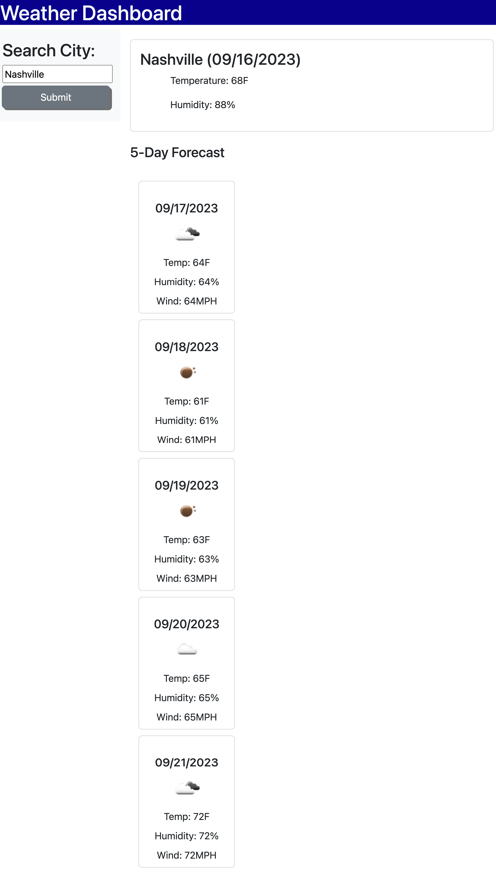

# weather-webpage

## Description
This weather app should allow a user to search for a city's weather. Using script.js, index.html, and style.css, this weather app allows you to search the forecast for any city. This also searches the 5 day forecast.  

## Deployed
[Deployed](https://zoeedge16.github.io/weather-webpage/)

[Repository](https://github.com/zoeedge16/weather-webpage)

## Screenshot

